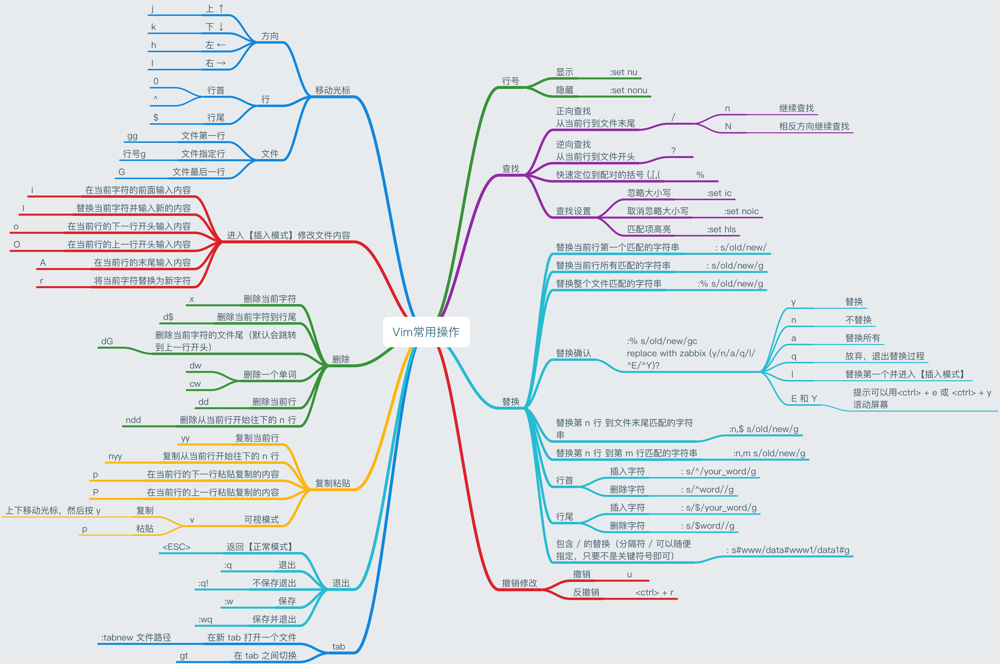

### vim 常用操作

> 右键图片另存为本地看大图



### vim 基本配置

```bash
➜  cd ~ && wget https://raw.githubusercontent.com/whorusq/linux-learning/master/vim/.vimrc 
```

详见：[https://github.com/whorusq/linux-learning/blob/master/vim/.vimrc](https://github.com/whorusq/linux-learning/blob/master/vim/.vimrc)
