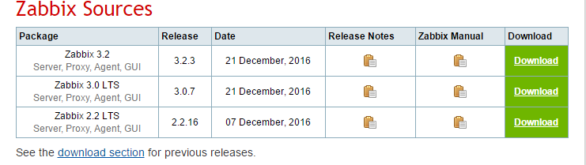
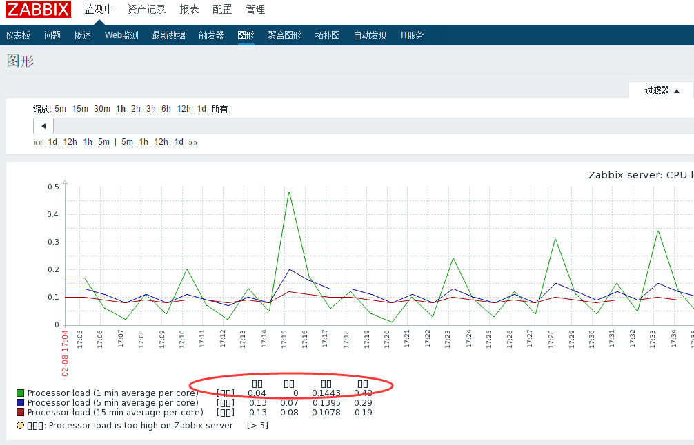
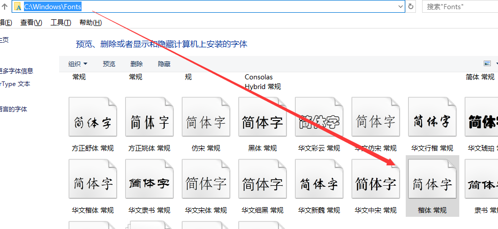

> 基于 CentOS6.x + Zabbix3.2.3（最新开发版，稳定版是 3.0 LTS）

本文的 Zabbix 采用**编译安装**，对 web环境及 Zabbix 配置更可控，也便于统一管理，目录结构如下：

- **/alidata/server**  web 程序安装目录，包括 PHP、Apache、MySQL
- **/alidata/www** web 根目录
- **/usr/local/zabbix**  zabbix 程序安装目录

**注意：**

- 本文仅用于学习、演示，将【server/agent/前端】都装在了同一台机器上，实际使用时请根据服务器环境进行修改完善。
- 用到的 LAMP 环境是采用阿里云上的一键安装包编译安装，可[点击此处下载](/files/sh-1.5.5.zip)


---
### 本文目录

1. [下载源码包](#1-下载源码包)
2. [安装 Zabbix 服务](#2-安装-zabbix-服务)
	- 2.1. [数据库配置](#21-数据库配置主要用于-server-端存储监控指标数据供前端展现分析)
	- 2.2. [安装 zabbix-server（监控服务端）、zabbix-agentd（被监控客户端）](#22-安装-zabbix-server监控服务端zabbix-agentd被监控客户端)
	- 2.3. [修改对应的配置文件](#23-修改对应的配置文件)
	- 2.4. [创建日志文件](#24-创建日志文件)
	- 2.5. [启动](#25-启动)
	- 2.6. [验证服务是否启动成功](#26-验证服务是否启动成功)
3. [安装 Zabbix 前端](#3-安装-zabbix-前端)
	- 3.1. [将 Zabbix 源码包中 frontends/php/ 下的所有文件拷贝到 web 目录下](#31-将-zabbix-源码包中-frontendsphp-下的所有文件拷贝到-web-目录下)
	- 3.2. [浏览器打开对应的 web 访问地址，开始安装](#32-浏览器打开对应的-web-访问地址开始安装)
	- 3.3. [登录前端](#33-登录前端)
4. [Zabbix 服务管理脚本及自启动设置](#4-zabbix-服务管理脚本及自启动设置)
	- 4.1. [拷贝到系统 init.d 目录并修改相关安装参数](#41-拷贝到系统-initd-目录并修改相关安装参数)
	- 4.2. [启动测试](#42-启动测试)
	- 4.3. [加入自启动](#43-加入自启动)
5. [常见问题](#5-常见问题)
	- 5.1. [添加新的 Zabbix 客户端（被监控端）](#51-添加新的-zabbix-客户端被监控端)
	- 5.2. [启动测试](#52-安装-php-的-gettext-扩展)
	- 5.3. [前端切换中文显示](#53-前端切换中文显示)
	- 5.4. [图表中文乱码](#54-图表中文乱码)

---


### 1. 下载源码包

+ 官网首页：[http://www.zabbix.com](http://www.zabbix.com/)
+ 程序地址：[http://www.zabbix.com/download](http://www.zabbix.com/download) （如下图所示）



```
下载、解压并进入源码目录（下面的地址如果速度较慢，可直接浏览器或软件下载好后，上传到服务器）
# wget -c 'https://jaist.dl.sourceforge.net/project/zabbix/ZABBIX%20Latest%20Stable/3.2.3/zabbix-3.2.3.tar.gz'
# tar -zxvf zabbix-3.2.3.tar.gz
# cd zabbix-3.2.3
```

### 2. 安装 Zabbix 服务
#### 2.1. 数据库配置（主要用于 server 端存储监控指标数据，供前端展现、分析）

```
# mysql -uroot -pfea7615808
Warning: Using a password on the command line interface can be insecure.
Welcome to the MySQL monitor.  Commands end with ; or \g.
Your MySQL connection id is 1
Server version: 5.6.21-log MySQL Community Server (GPL)

Copyright (c) 2000, 2014, Oracle and/or its affiliates. All rights reserved.

Oracle is a registered trademark of Oracle Corporation and/or its
affiliates. Other names may be trademarks of their respective
owners.

Type 'help;' or '\h' for help. Type '\c' to clear the current input statement.

mysql> create database zabbix character set utf8 collate utf8_bin;

mysql> CREATE USER 'zabbix'@'%' IDENTIFIED BY 'zabbix';
mysql> GRANT ALL PRIVILEGES ON zabbix.* TO "zabbix"@"%" IDENTIFIED BY "zabbix" WITH GRANT OPTION;
mysql> GRANT ALL PRIVILEGES ON zabbix.* TO "zabbix"@"localhost" IDENTIFIED BY "zabbix" WITH GRANT OPTION;
mysql> flush privileges;

mysql> quit;
Bye
# mysql -uroot -pfea7615808 zabbix < database/mysql/schema.sql
# mysql -uroot -pfea7615808 zabbix < database/mysql/images.sql
# mysql -uroot -pfea7615808 zabbix < database/mysql/data.sql
```

#### 2.2. 安装 zabbix-server（监控服务端）、zabbix-agentd（被监控客户端）

安装依赖库：

```
# yum install -y unixODBC-devel net-snmp-devel OpenIPMI-devel
```

新建 zabbix 独立用户，编译、安装

```
# groupadd zabbix
# useradd -g zabbix zabbix
# ./configure --enable-server --enable-agent --with-mysql --with-net-snmp --with-libcurl --with-libxml2 --with-openipmi --with-unixodbc --prefix=/usr/local/zabbix
# make
# make install

编译测试
echo $?;
```

#### 2.3. 修改对应的配置文件

- 服务端

	```
	# vim /usr/local/zabbix/etc/zabbix_server.conf
	LogFile=/tmp/zabbix_server.log
	DBName=zabbix
	DBUser=zabbix
	DBPassword=zabbix
	```

- 客户端

	```
	# vim /usr/local/zabbix/etc/zabbix_agentd.conf
	LogFile=/tmp/zabbix_agentd.log
	Server=127.0.0.1
	ServerActive=127.0.0.1
	Hostname=Zabbix server ----- 这里对应在 zabbix 前端创建 host 时要填写的 Host name
	```

#### 2.4. 创建日志文件

```
# touch /tmp/zabbix_server.log
# touch /tmp/zabbix_agentd.log
# chmod 777 /tmp/zabbix_*.log
```

#### 2.5. 启动

- 启动服务端

	```
	# /usr/local/zabbix/sbin/zabbix_server
	```

	如果启动服务端时报错：
	
	> /usr/local/zabbix/sbin/zabbix_server: error while loading shared libraries: libmysqlclient.so.18: cannot open shared object file: No such file or directory
	>
	> 解决方法：
	> 
	> ```
	> # ll /alidata/server/mysql/lib/|grep libmysqlclient.so.18
	> # echo "/alidata/server/mysql/lib" >>/etc/ld.so.conf
	> # ldconfig
	> ```
	>
	> 重新执行启动命令

- 启动客户端

	```
	# /usr/local/zabbix/sbin/zabbix_agentd
	```

#### 2.6. 验证服务是否启动成功

``` bash
$ netstat -tlunp|grep 1005*
tcp        0      0 0.0.0.0:10050               0.0.0.0:*                   LISTEN      24806/zabbix_agentd
tcp        0      0 0.0.0.0:10051               0.0.0.0:*                   LISTEN      21992/zabbix_server
```

### 3. 安装 Zabbix 前端

#### 3.1. 将 Zabbix 源码包中 frontends/php/ 下的所有文件拷贝到 web 目录下

```
# mkdir -p /alidata/www/zabbix
# cd zabbix-3.2.3
# cp -rp frontends/php/* /alidata/www/zabbix/
# chmod -R 755 /alidata/www/zabbix/
```

#### 3.2. 浏览器打开对应的 web 访问地址，开始安装

地址如：`http://192.168.137.11/zabbix/setup.php`

操作步骤：

- 一：欢迎界面
- 二：依赖检查，建议所有检查项目都 OK 再进入下一步，包括 *fail* 和 *warning* 的项
- 三：数据库配置
- 四：Zabbix server 配置（IP地址、端口号）
- 五：开始安装前的配置预览
- 六：完成安装

**整个配置过程，主要是 zabbix 依赖检查（PHP 相关参数配置和扩展）和生成一个 zabbix.conf.php 配置文件。**

> 第六步之后如果提示无法创建配置文件 `Cannot create the configuration file.` 一般是用户或目录权限的问题，解决方式如下：
> 
> - 方法一：修改 zabbix 目录的权限，如：`chmod -R 777 /alidata/www/zabbix/`
> - 方法二：根据给出的操作步骤，直接下载配置好的文件，并上传到 zabbix 前端对应的配置目录下。

#### 3.3. 登录前端

地址如：`http://192.168.137.11/zabbix`

> 默认用户名 Admin 密码 zabbix

登录之后，在 **Configuration > Hosts** 下可查看默认已经添加的主机

### 4. Zabbix 服务管理脚本及自启动设置

> 其实服务管理脚本（start/stop/restart）已经内置在 zabbix 的源文件目录下，如：..../zabbix-3.2.3/misc/init.d，这里包含了 Linux 不同发行版的脚本，根据实际环境选择合适的，然后按照以下步骤操作：

#### 4.1. 拷贝到系统 init.d 目录并修改相关安装参数

```
# cd ..../zabbix-3.2.3/misc/init.d
# cp fedora/core/zabbix_* /etc/init.d/

修改 server 端启动脚本
# vim /etc/init.d/zabbix_server
......
BASEDIR=/usr/local/zabbix ----- zabbix 安装目录
BINARY_NAME=zabbix_server ----- zabbix 二进制文件名称（对应 zabbix 安装目录 sbin/ 下的名称）
.....

修改 agent 端启动脚本
# vim /etc/init.d/zabbix_agentd
......
BASEDIR=/usr/local/zabbix
BINARY_NAME=zabbix_agentd
.....
```

#### 4.2. 启动测试

```
# service zabbix_agentd restart 或 /etc/init.d/zabbix_agentd rstart
Shutting down zabbix_agentd:                               [  OK  ]
Starting zabbix_agentd:                                    [  OK  ]
```

#### 4.3. 加入自启动

```
# chkconfig --add zabbix_server
# chkconfig --add zabbix_agentd
# chkconfig --level 345 zabbix_server on
# chkconfig --level 345 zabbix_agentd on
# chkconfig --list|grep zabbix*
zabbix_agentd   0:off   1:off   2:off   3:on    4:on    5:on    6:off
zabbix_server   0:off   1:off   2:off   3:on    4:on    5:on    6:off
```

### 5. 常见问题

#### 5.1. 添加新的 Zabbix 客户端（被监控端）
每添加一台要监控的机器，只安装 zabbix-agent 即可，操作如下：

```
# groupadd zabbix
# useradd -g zabbix zabbix
# ./configure --enable-agent --prefix=/usr/local/zabbix
# make && make install
```

之后的修改配置文件、创建日志文件、启动的方法同上（2.2 至 2.6），需根据实际环境对部分参数进行修改。

#### 5.2. 安装 PHP 的 gettext 扩展

```
# cd /root/sh-1.5.5/php-5.5.7/ext/gettext     ----- 进入 PHP 源码包下
# /alidata/server/php-5.5.7/bin/phpize
# ./configure --with-php-config=/alidata/server/php-5.5.7/bin/php-config
# make
# make install
# echo "extension=gettext.so" >> /alidata/server/php-5.5.7/etc/php.ini
# tail /alidata/server/php-5.5.7/etc/php.ini     ----- 检查扩展是否追加进 PHP 扩展文件
# service httpd restart
```

#### 5.3. 前端切换中文显示

- 登录之后，点击右上角用户图标

	

- 选择 Chinese (zh_CN)

	")

-  单击底部 update 按钮保存，页面将自动刷新

#### 5.4. 图表中文乱码

图表中的乱码类似下图：



解决步骤：

- a. 进入 C:\Windows\Fonts 中找到楷体（如下图），拷贝到桌面变为  simkai.ttf

	

- b. 上传到服务器 zabbix 前端的字体目录下，我的是 /alidata/www/zabbix/fonts
- c. 修改 zabbix 前端的配置文件，如下

	```
	# cd  /alidata/www/zabbix/
	# sed -i 's/DejaVuSans/simkai/g' ./include/defines.inc.php
	```

- b. 刷新页面

	> 如果经过上面的步骤还是存在乱码，有可能是创建数据的时候没指定 utf-8 编码，请参照上面 [2.1. 数据库配置](#21-数据库配置主要用于-server-端存储监控指标数据供前端展现分析) 进行修改
